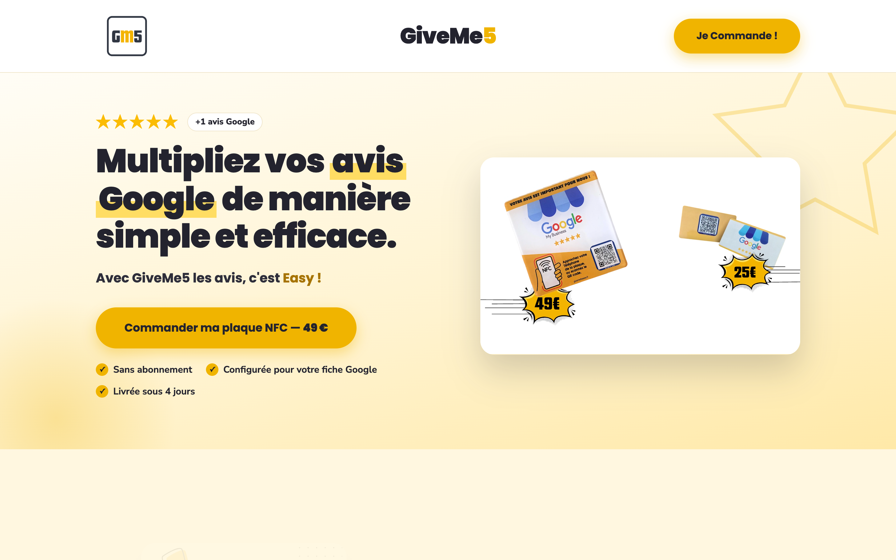
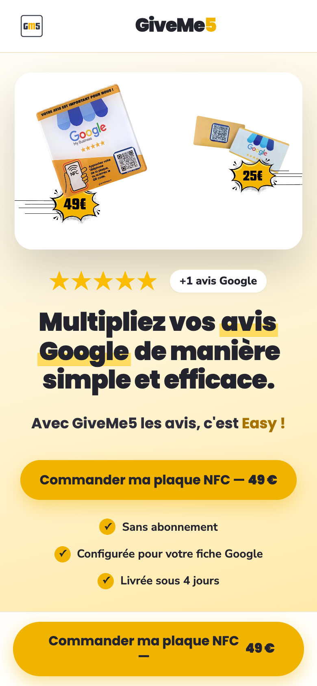
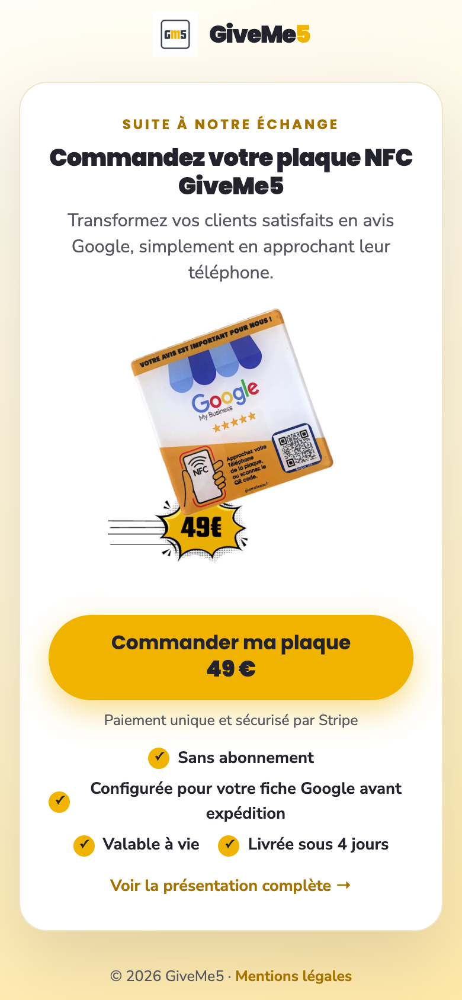
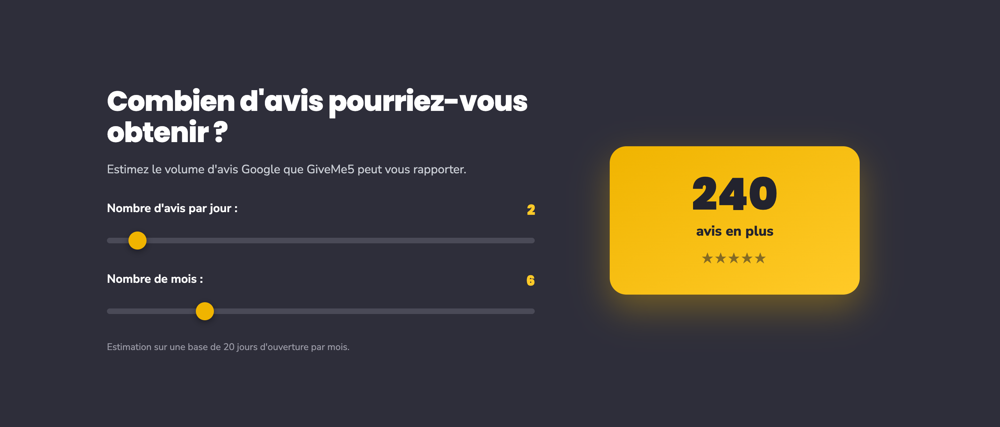
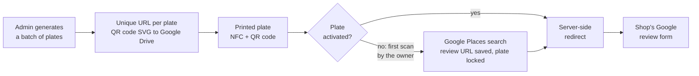

# GiveMe5

**NFC and QR code plates that take a shop's customers straight to its Google review form, in one scan.**

[](https://www.repostatus.org/#active)
[](LICENSE)



## Overview

A shop lives off its Google rating, yet a happy customer almost never leaves a review: they would have to find the
listing, sign in and write. Asking out loud does not work, and texting a link requires a phone number.

GiveMe5 is a plate (or a card) on the counter. The customer taps it with their phone or scans the QR code and lands
directly on the shop's Google review form: no app, no account, no search. A plate costs €49 and a card €25, with
no subscription. This repository holds the public sales site; the back office that runs the plates is private.

| Mobile | Order page sent after a call |
|---|---|
|  |  |

## Features

- **One scan to the review form** — NFC and QR code on the same plate, redirected server-side to the shop's Google
  review form.
- **Self-service activation** — plates are made in batches and linked to a shop later: on the first scan, the owner
  searches for their business and the plate is bound to it, with no action on the seller's side.
- **Locked once activated** — an activated plate can no longer be pointed elsewhere, and only a Google review URL is
  accepted.
- **Review estimator** — two sliders estimate the reviews a shop can expect (reviews per day × months × 20 opening
  days).
- **Checkout in one link** — every call to action leads to a Stripe Payment Link: one-off payment, no checkout code
  to maintain.



## Getting started

Live at **https://hello.giveme5xxxxx.fr**.

The site is static, with no build and no API key. To run it locally:

```bash
git clone https://github.com/cedricgicquiaud/giveme5.git
cd giveme5 && python3 -m http.server 8000   # http://localhost:8000
```

## Architecture


Three parts: this static sales site, a private Django back office that makes and redirects the plates, and no-code
automations around the sale. A plate works like this:



Key decisions:
- **Bind the plate after manufacturing.** Each plate carries a unique URL, not a shop. On the first scan, a Google
  Places search returns the business `place_id`, and the back office stores
  `search.google.com/local/writereview?placeid=…`. Plates are printed in series and sold to anyone.
- **Redirect on the server, not in the plate.** The NFC chip and the QR code only hold the plate URL. If a shop
  changes, the plate is not reprinted; and once activated, the destination is locked against tampering.
- **Static site and a payment link.** Hand-written HTML, assets hosted with the site, Stripe as the only external
  script besides fonts. Nothing to compile, nothing to break. Deployed by Coolify (nginx) on every push to `main`.
- **Automate what costs time at each sale.** Invoicing (Pipedrive deal → Qonto invoice → email) and customer support
  (a chatbot answering from a Google Drive knowledge base with GPT-4o-mini) run in n8n and Make, not in code.

<details>
<summary>Project structure</summary>

```
index.html             full sales page: hero, estimator, how it works, FAQ
commande/index.html    short order page, texted after a phone call
mentions-legales.html  legal notice
assets/img/            product photos and visuals
assets/video/          product videos, self-hosted
docs/screenshots/      README screenshots
```

</details>

## Status

In production and maintained. More than 200 shops equipped. The back office has its own test suite and continuous
integration; dependency updates are checked on every pull request before a human merge.

## License

All rights reserved. The code is published for reading only.
